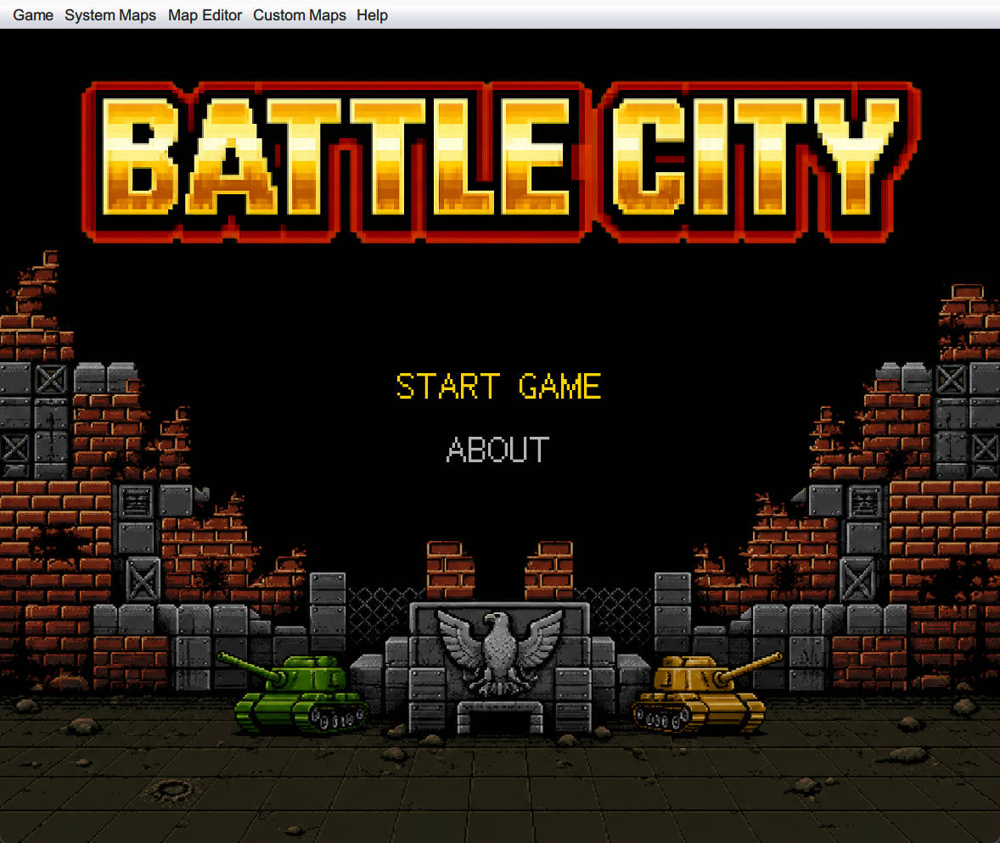
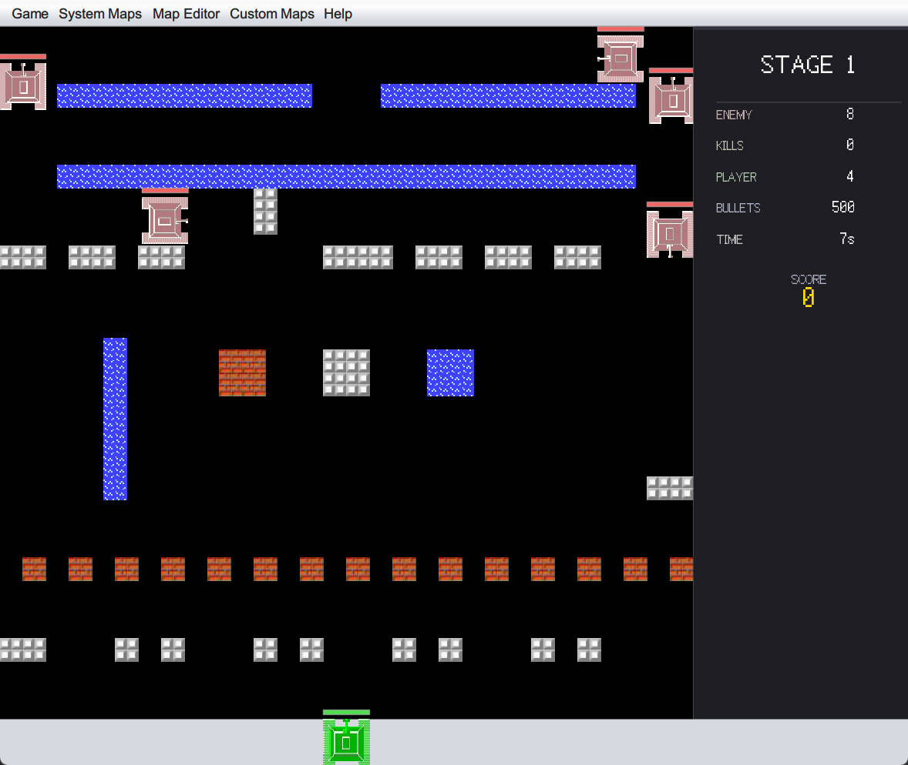
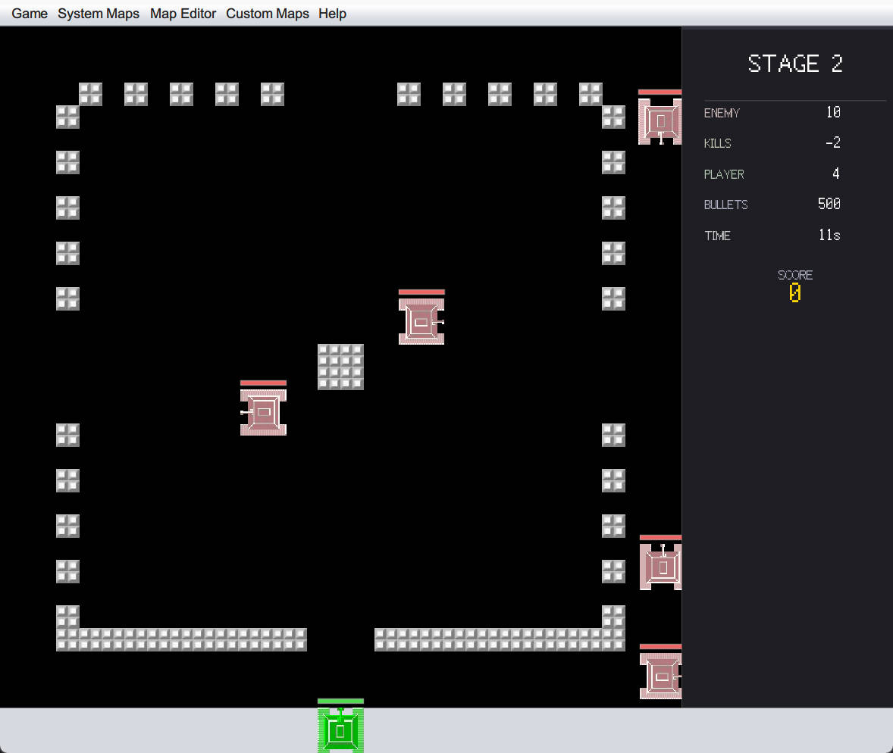
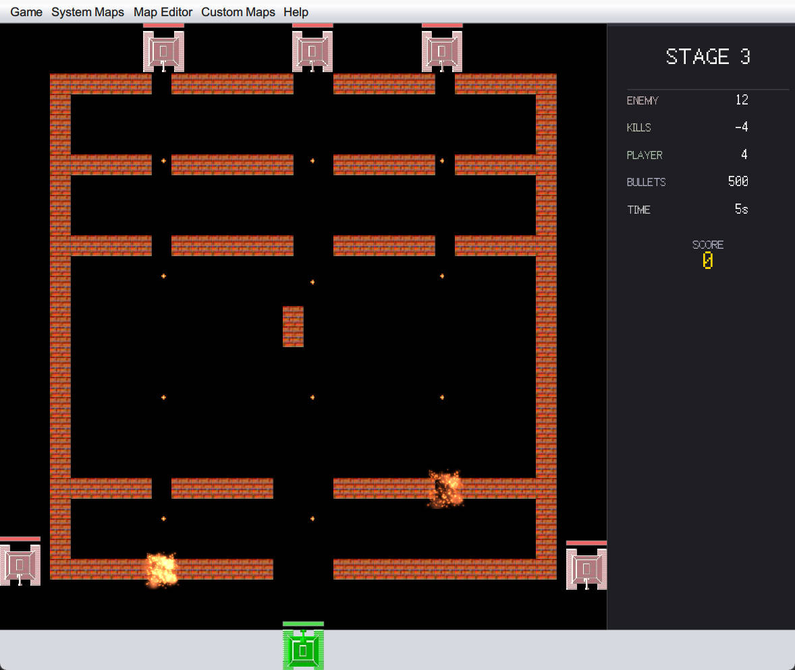
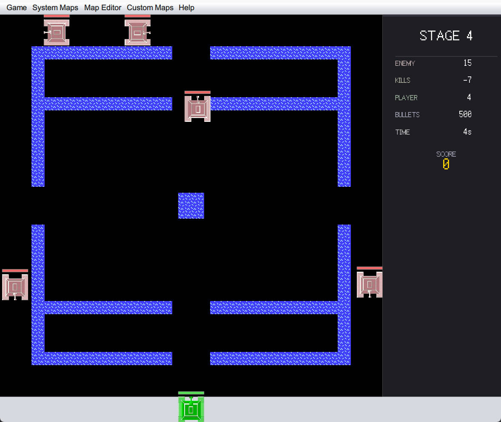
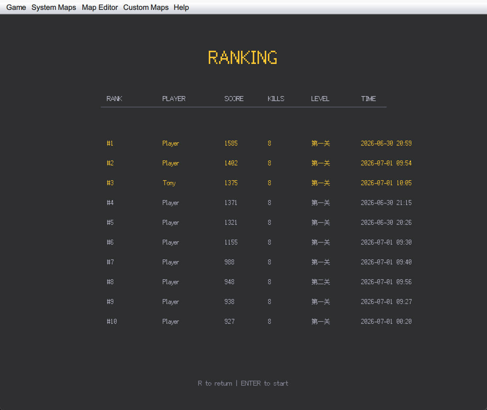

<p align="center">
  
</p>

# Tank Battle

经典俯视角坦克射击游戏，基于 Java Swing + Spring Boot 构建。支持中英文双语切换、多级地图、内置地图编辑器和排行榜。

## 截图

| 开始界面 | 关卡 1 | 关卡 2 |
|:---:|:---:|:---:|
|  |  |  |

| 关卡 3 | 关卡 4 | 排行榜 |
|:---:|:---:|:---:|
|  |  |  |

## 亮点

- **中英文双语切换**：菜单、HUD、结算界面全面支持 English / 中文 实时切换
- **精致的 Swing UI**：自定义像素字体、菜单栏导航、游戏内 HUD 信息面板
- **倍速调节**：0× / 2× / 4× / 8× / 10× 五档速度控制
- **排行榜系统**：记录每局得分、击杀、耗时，支持中文 / 英文双语言显示
- **内置地图编辑器**：鼠标放置砖墙、铁墙、水域，可保存为自定义地图
- **多级系统地图**：5 张预置关卡，XML 定义地形数据

## 技术栈

- **语言**: Java 8
- **框架**: Spring Boot 2.3.2
- **构建**: Maven
- **UI**: Swing
- **XML 解析**: Apache Commons Digester 3

## 快速开始

### 环境要求

- JDK 8+
- Maven 3.6+

### 运行

```bash
# Windows
mvnw.cmd spring-boot:run

# Linux / macOS
./mvnw spring-boot:run
```

或使用系统 Maven:

```bash
mvn spring-boot:run
```

### 打包

```bash
mvn clean package
java -jar target/tankbattle-0.0.1-SNAPSHOT.jar
```

## 操作说明

| 按键 | 功能 |
|:---|:---|
| ↑ ↓ ← → | 控制坦克移动 |
| X | 射击 |
| P | 暂停/继续 |
| R | 显示/隐藏排行榜 |
| Enter | 确认（菜单/结算） |

## 地图编辑器

内置地图编辑器，可按 C 键在砖墙、铁墙、水域之间切换，点击鼠标放置障碍物。

## 项目结构

```
src/main/java/com/course/tankbattle/
├── constant/       # 游戏常量
├── context/        # 游戏上下文
├── dto/            # 数据传输对象
├── entity/         # 游戏实体（坦克、子弹、砖墙等）
├── enums/          # 枚举定义
├── listener/       # 键盘/鼠标事件监听
├── resource/       # 图片、地图、XML 解析
├── service/        # 核心服务（计算、绘制、控制等）
├── task/           # 定时任务（子弹移动、AI 移动等）
├── util/           # 工具类
└── view/           # Swing 视图层
```

Tank Battle Course Edition — 建立在经典坦克大战基础上的课程项目。
